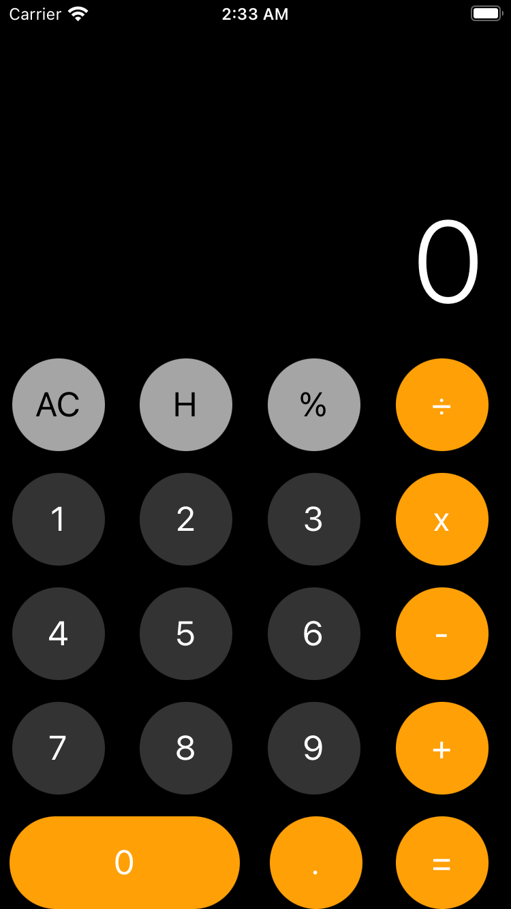

# React Calculator with Tailwind CSS

This project is a simple calculator built with React and Tailwind CSS. It uses React's `useContext` and `useReducer` hooks to manage the calculator's state.

| Home Page | History Modal |
|:---:|:---:|
|  |  |


## Installation

First, clone the repository to your local machine:

```bash
git clone https://github.com/lucascraveiropaes/calculator.git
```

Then, navigate into the project directory and install the dependencies:

```bash
cd your-repository
npm install
```

Usage
To start the development server, run the following command:

```bash
npm start
```
